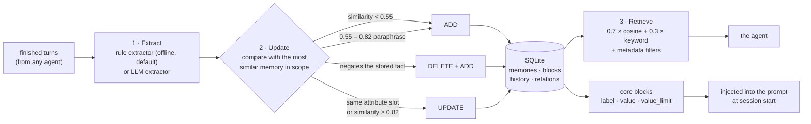

<div align="center">

# MemVault

**Local long-term memory for coding agents.** One SQLite file you own, exposed over **MCP**, REST, CLI and a dashboard. Works with **no API key at all** — the offline embedder and rule extractor are the default, and an OpenAI-compatible gateway is an opt-in upgrade.

English · [中文](README.zh.md)


</div>

---

## What this is

An agent forgets everything between sessions. MemVault is the file it remembers with: a Python service that turns finished conversations into **audited, deduplicated facts**, retrieves them by hybrid semantic + keyword search, and keeps a small set of **always-visible core blocks** you can edit by hand.

It is deliberately unambitious about infrastructure and picky about correctness:

- **One SQLite file** (`data/memvault.db`) — no server to host, no account, no sync daemon.
- **Every change is audited** (`history`) and contradictions are recorded as `relations`, so "how did this memory end up like this?" is a question the database answers.
- **Nothing is deleted behind your back.** The two maintenance tools (`consolidate`, `purge`) default to dry-run and must be told explicitly to apply.

## How it works



The middle stage is the whole point: writing a fact is a **decision**, not an insert. Full rules, thresholds and the reasoning behind them are in [docs/ARCHITECTURE.md](docs/ARCHITECTURE.md).

## Quick start

```powershell
git clone https://github.com/zhang66633/memvault && cd memvault
python -m venv .venv ; .venv\Scripts\python -m pip install -r requirements.txt

# 1 · use it from the CLI (no server needed)
.venv\Scripts\python -m memvault.cli add "I prefer short answers"
.venv\Scripts\python -m memvault.cli search "how do I like answers"

# 2 · or run the service: REST + dashboard on http://127.0.0.1:8780
.venv\Scripts\python run_server.py

# 3 · plug it into a coding agent as an MCP server
claude mcp add --transport stdio memvault -- D:\Claude_code\memory\.venv\Scripts\python.exe -m memvault.mcp_server
```

No `.env` is required. Offline defaults: **local feature-hashing embedder** (384-dim, deterministic, zero network) + **rule extractor**. Copy `.env.example` to `.env` to switch either one to an OpenAI-compatible endpoint — `examples/llm_check.py` self-tests the key, base URL and models before you rely on them.

## Surfaces

| Surface | What it is | Count |
|---|---|---|
| **MCP stdio server** | JSON-RPC 2.0 over stdio — the agent's memory tools; no HTTP, no network | 16 tools |
| **REST API** | FastAPI; `/api/v1/*` for memories, blocks, relations, history, stats, plus `/health` and a WebSocket | 20 routes |
| **CLI** | Every operation without starting anything (`python -m memvault.cli …`) | 16 subcommands |
| **Dashboard** | Memory cards, scope filters, score bars, graph, blocks, growth curve — served from `/dashboard/` | 1 page |

### MCP tools (16)

`memory_add` · `memory_search` · `memory_get` · `memory_get_all` · `memory_whoami` · `memory_update` · `memory_delete` · `memory_history` · `memory_relations` · `memory_stats` · `memory_consolidate` · `memory_purge` · `core_memory_get` · `core_memory_append` · `core_memory_replace` · `core_memory_delete`

Full parameter table: [docs/MCP.md](docs/MCP.md).

### CLI (16)

```text
add  search  all  get  history  update  delete  delete-all
blocks-get  blocks-set  blocks-delete  relations  stats  whoami
consolidate  purge
```

```powershell
.venv\Scripts\python -m memvault.cli whoami                    # resolved default scope
.venv\Scripts\python -m memvault.cli add "I live in Nanjing"   # scope optional
.venv\Scripts\python -m memvault.cli consolidate               # preview only
.venv\Scripts\python -m memvault.cli purge --older-than-days 90 --apply
```

### REST (20)

| Method | Path | Purpose |
|---|---|---|
| `POST` | `/api/v1/memories/` | add from messages (extract → decide) |
| `POST` | `/api/v1/memories/search` | hybrid search |
| `GET` | `/api/v1/memories/` | list in scope |
| `GET` `PUT` `DELETE` | `/api/v1/memories/{id}` | read / edit / delete one |
| `GET` | `/api/v1/memories/{id}/history` | the audit trail |
| `DELETE` | `/api/v1/memories/` | delete all in scope |
| `POST` | `/api/v1/memories/consolidate` | merge near-duplicates (dry-run default) |
| `POST` | `/api/v1/memories/purge` | age/type cleanup (dry-run default) |
| `GET` | `/api/v1/relations` | the contradiction graph |
| `POST` `GET` | `/api/v1/blocks` | create / list core blocks |
| `PUT` `DELETE` | `/api/v1/blocks/{scope_type}/{scope_id}/{label}` | replace / delete a block |
| `GET` | `/api/v1/users` · `/api/v1/stats` · `/api/v1/whoami` · `/health` | introspection |
| `WS` | `/api/v1/ws` | live updates (scope-subscribable) |

Details: [docs/API.md](docs/API.md).

## Configuration

Everything is optional; copy `.env.example` to `.env`.

| Variable | Default | Meaning |
|---|---|---|
| `MEMVAULT_DB_PATH` | `data/memvault.db` | the store |
| `MEMVAULT_EXTRACTOR` | `rule` | `rule` (offline, deterministic) or `llm` |
| `MEMVAULT_EMBEDDER` | `local` | `local` (offline feature hashing) or `openai` |
| `MEMVAULT_EMBEDDING_DIM` | `384` | dimension of the local embedder |
| `MEMVAULT_VECTOR_WEIGHT` / `MEMVAULT_KEYWORD_WEIGHT` | `0.7` / `0.3` | the retrieval blend |
| `MEMVAULT_BLOCK_LIMIT` | `2000` | default `value_limit` for new core blocks |
| `MEMVAULT_HOST` / `MEMVAULT_PORT` | `127.0.0.1` / `8780` | REST bind |
| `MEMVAULT_DEFAULT_USER_ID` / `_AGENT_ID` / `_RUN_ID` | empty | pin the scope instead of deriving it |
| `MEMVAULT_SCOPE_USER_FROM_OS` / `_AGENT_FROM_PROJECT` | `1` | derive defaults from OS user / project path |
| `MEMVAULT_LLM_EXTRA_BODY` | empty | JSON merged into every chat request — needed on gateways whose models emit a reasoning preamble that breaks JSON extraction |
| `OPENAI_API_KEY` · `OPENAI_BASE_URL` · `OPENAI_CHAT_MODEL` · `OPENAI_EMBEDDING_MODEL` | empty · `https://api.openai.com/v1` · — | only used when an OpenAI-compatible path is selected |

## Core blocks and injection

Core blocks are the always-visible part: `label + value + value_limit`, stored per scope, editable by the agent (`core_memory_append` / `core_memory_replace`) or by you. They are what actually reaches the model's prompt — retrieval alone does not; [docs/INJECTION.md](docs/INJECTION.md) explains the difference and gives the recall/write instruction templates that make memory get *used* rather than merely stored.

## Multi-agent / multi-session isolation

One shared database, three orthogonal scope keys:

| Key | Default when omitted | Meaning |
|---|---|---|
| `user_id` | OS login | the person |
| `agent_id` | current project path slug | the project/agent |
| `run_id` | empty | a single session/run |

```powershell
.venv\Scripts\python -m memvault.cli whoami   # {user_id: …, agent_id: …, run_id: …}
```

Claude Code injects `CLAUDE_PROJECT_DIR`, so different projects are separated automatically. See [docs/MULTI_AGENT.md](docs/MULTI_AGENT.md).

## Design decisions

**Writing is a decision, not an insert.** `_decide` compares a new fact with the single most similar memory in scope: below 0.55 similarity it is new → `ADD`; if it negates the stored fact → `DELETE` the old one and add; if it fills the same attribute slot (name / job / address / …) or scores ≥ 0.82 → `UPDATE`. Facts that clean up to nothing are dropped (`NONE`) instead of becoming blank rows.

**The 0.55–0.82 band deliberately coexists.** Two phrasings of one fact may both live in the store; that is a choice, not an oversight. Merging them automatically would risk destroying a distinction nobody noticed, so `consolidate` does it on demand at a stricter bar (≥ 0.92) — and after measuring the cost (O(n²), ≈1.1 s per 10k rows) it refuses scopes above 10k rows unless you raise the cap explicitly.

**Capture never depends on a second process.** Callers write through the engine (CLI/MCP/direct import) rather than `POST /api/v1/memories/`, so memory capture cannot silently stop because the HTTP server happens to be down.

**Offline by default, upgradeable on purpose.** The default embedder is deterministic feature hashing over words and CJK bigrams, and the default extractor is regex rules. That keeps the test suite fully offline and the service usable with zero keys — and it is why retrieval quality, not architecture, is the reason to configure a real embedding model.

**Maintenance is explicit.** No TTL, no decay, no background compaction. `consolidate` and `purge` are the human's tools, both dry-run by default, and `purge` refuses to run without at least one filter.

**Everything is audited.** `history` records ADD/UPDATE/DELETE with old and new text; contradictions become `relations`. The API exposes both, so a wrong memory can be traced instead of merely deleted.

## Verification

```powershell
.venv\Scripts\python -m pytest -q          # 187 tests, fully offline
.venv\Scripts\python tools\bench_retrieval.py --n 2000
```

- **187 tests pass offline**: the OpenAI paths are covered with mocked HTTP transports, so the suite never needs a key or a network. Scope defaults, storage, engine decisions, CLI, MCP server and MCP subprocess are all covered.
- **The performance rewrite was verified against the code it replaced**: 147/147 generated cases produced identical ids, history chains, relations and decision sequences (see [DEVLOG Sprint 14](docs/DEVLOG.md)).
- **Measured on this machine** (N = 2000 memories, median of 5): seed 129 ms · search 3.5 ms/query warm (11.3 ms cold) · add 83 ms per 5 facts · `get_all(100)` 6 ms · `consolidate` dry-run 37 ms.
- **Every iteration's reasoning and pitfalls are recorded** in [docs/DEVLOG.md](docs/DEVLOG.md) — including the ones that were my own mistakes.

## Known limits

- **The offline embedder is lexical, not semantic.** It hashes shared words and CJK bigrams; a paraphrase sharing no token will not be recalled. Configure an OpenAI-compatible embedder for real semantic search.
- **The write path compares against only the single most similar memory.** A new fact that *contradicts* a second, less similar row will not notice it.
- **No TTL, decay or automatic compaction.** The store grows until you run `consolidate` / `purge`.
- **`consolidate` is O(n²)** — capped at 10k rows by default, with the measured cost curve in the devlog.
- **Embedding dimension is fixed by the first write.** Switching embedder/dimension on an existing database requires a re-embed.
- **Two path-portability warts are known and unfixed**: `mcp_launcher.py` hardcodes the author's install path, and `tests/test_scopes.py` asserts on it (so that test fails on non-Windows).
- **The dashboard is read/observe-oriented**; editing happens through MCP, REST or CLI.
- **`start-memvault.bat` / `stop-memvault.bat` are Windows conveniences.** The service itself is cross-platform; only these scripts are not.

## Roadmap

- **Re-embed in place** when the embedding model changes, instead of requiring a fresh database.
- **Scope-aware export/import** (one file per scope) so a store can move between machines without copying SQLite.
- **Optional decay/TTL for `procedural` memories** — with an explicit, inspectable policy rather than a hidden timer.
- **A retrieval evaluation set** so embedder choices can be compared by measured recall rather than by feel.

## Documentation

| Document | Contents |
|---|---|
| [docs/ARCHITECTURE.md](docs/ARCHITECTURE.md) | the pipeline, the data model, the decision rules |
| [docs/API.md](docs/API.md) | every REST route with request/response shapes |
| [docs/MCP.md](docs/MCP.md) | the 16 tools, client config, troubleshooting |
| [docs/INJECTION.md](docs/INJECTION.md) | how to get memories actually injected and used |
| [docs/MULTI_AGENT.md](docs/MULTI_AGENT.md) | scope conventions for several agents/projects |
| [docs/PLAN.md](docs/PLAN.md) | the development plan and acceptance criteria |
| [docs/DEVLOG.md](docs/DEVLOG.md) | iteration log: decisions, measurements, mistakes |
| [docs/architecture_overview.mmd](docs/architecture_overview.mmd) | the whole picture as one diagram |

## License

MIT — see [LICENSE](LICENSE).
