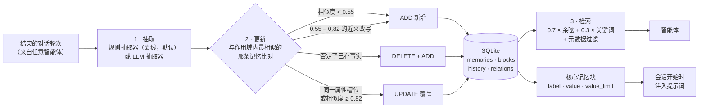

<div align="center">

# MemVault

**给编程智能体的本地长期记忆。** 一个属于你的 SQLite 文件，通过 **MCP**、REST、CLI 和可视化控制台对外提供。**完全不需要 API Key** —— 离线嵌入器与规则抽取器就是默认配置，接一个 OpenAI 兼容网关只是可选升级。

[English](README.md) · 中文


</div>

---

## 这是什么

智能体换个会话就忘光。MemVault 就是它用来记住的那个文件：一个 Python 服务，把结束的对话变成**可追溯、会自动去重的长期事实**，用向量 + 关键词混合检索取回，并维护一小撮**始终可见的核心记忆块**供你手工编辑。

它对基础设施刻意低要求，但对正确性很挑：

- **就一个 SQLite 文件**（`data/memvault.db`）——没有要托管的服务、没有账号、没有同步进程。
- **每一次变更都有审计**（`history`），矛盾会记成 `relations`——所以「这条记忆是怎么变成现在这样的」是数据库能回答的问题。
- **不会背着你删东西。** 两个维护工具（`consolidate` / `purge`）默认只预览，必须显式要求才真的执行。

## 它怎么工作



中间那一步才是重点：写入一条事实是一次**判定**，不是一次插入。完整规则、阈值与理由见 [docs/ARCHITECTURE.md](docs/ARCHITECTURE.md)。

## 快速开始

```powershell
git clone https://github.com/zhang66633/memvault && cd memvault
python -m venv .venv ; .venv\Scripts\python -m pip install -r requirements.txt

# 1 · 不启服务，CLI 直接用
.venv\Scripts\python -m memvault.cli add "我喜欢简洁的回答"
.venv\Scripts\python -m memvault.cli search "我喜欢什么风格"

# 2 · 或者起服务：REST + 控制台 http://127.0.0.1:8780
.venv\Scripts\python run_server.py

# 3 · 以 MCP 服务器接入编程智能体
claude mcp add --transport stdio memvault -- D:\Claude_code\memory\.venv\Scripts\python.exe -m memvault.mcp_server
```

不需要 `.env`。离线默认值是**本地特征哈希嵌入器**（384 维、确定性、零网络）+ **规则抽取器**。把 `.env.example` 复制成 `.env` 就能把任一项换成 OpenAI 兼容端点——`examples/llm_check.py` 会先自检 Key、base URL 与模型，再决定要不要依赖它。

## 对外提供的形式

| 形式 | 是什么 | 数量 |
|---|---|---|
| **MCP stdio 服务器** | 基于 stdio 的 JSON-RPC 2.0 —— 智能体的记忆工具；不需要 HTTP、不需要联网 | 16 个工具 |
| **REST API** | FastAPI；`/api/v1/*` 覆盖记忆、块、关系、历史、统计，另有 `/health` 与一个 WebSocket | 20 条路由 |
| **CLI** | 不启动任何东西就能完成全部操作（`python -m memvault.cli …`） | 16 个子命令 |
| **可视化控制台** | 记忆卡片、作用域筛选、相关度条、记忆图谱、核心块、增长曲线，从 `/dashboard/` 提供 | 1 个页面 |

### MCP 工具（16）

`memory_add` · `memory_search` · `memory_get` · `memory_get_all` · `memory_whoami` · `memory_update` · `memory_delete` · `memory_history` · `memory_relations` · `memory_stats` · `memory_consolidate` · `memory_purge` · `core_memory_get` · `core_memory_append` · `core_memory_replace` · `core_memory_delete`

完整参数表见 [docs/MCP.md](docs/MCP.md)。

### CLI（16）

```text
add  search  all  get  history  update  delete  delete-all
blocks-get  blocks-set  blocks-delete  relations  stats  whoami
consolidate  purge
```

```powershell
.venv\Scripts\python -m memvault.cli whoami                        # 当前解析出的默认作用域
.venv\Scripts\python -m memvault.cli add "我住在南京"               # scope 可省略
.venv\Scripts\python -m memvault.cli consolidate                   # 只预览
.venv\Scripts\python -m memvault.cli purge --older-than-days 90 --apply
```

### REST（20）

| 方法 | 路径 | 作用 |
|---|---|---|
| `POST` | `/api/v1/memories/` | 从消息写入（抽取 → 判定） |
| `POST` | `/api/v1/memories/search` | 混合检索 |
| `GET` | `/api/v1/memories/` | 列作用域内记忆 |
| `GET` `PUT` `DELETE` | `/api/v1/memories/{id}` | 读 / 改 / 删单条 |
| `GET` | `/api/v1/memories/{id}/history` | 审计轨迹 |
| `DELETE` | `/api/v1/memories/` | 清空作用域 |
| `POST` | `/api/v1/memories/consolidate` | 合并近重复（默认 dry-run） |
| `POST` | `/api/v1/memories/purge` | 按时间/类型清理（默认 dry-run） |
| `GET` | `/api/v1/relations` | 矛盾关系图 |
| `POST` `GET` | `/api/v1/blocks` | 新建 / 列核心块 |
| `PUT` `DELETE` | `/api/v1/blocks/{scope_type}/{scope_id}/{label}` | 覆盖 / 删除核心块 |
| `GET` | `/api/v1/users` · `/api/v1/stats` · `/api/v1/whoami` · `/health` | 自省 |
| `WS` | `/api/v1/ws` | 实时推送（可订阅作用域） |

细节见 [docs/API.md](docs/API.md)。

## 配置

全部可选；把 `.env.example` 复制成 `.env` 即可。

| 变量 | 默认值 | 含义 |
|---|---|---|
| `MEMVAULT_DB_PATH` | `data/memvault.db` | 库文件位置 |
| `MEMVAULT_EXTRACTOR` | `rule` | `rule`（离线、确定性）或 `llm` |
| `MEMVAULT_EMBEDDER` | `local` | `local`（离线特征哈希）或 `openai` |
| `MEMVAULT_EMBEDDING_DIM` | `384` | 本地嵌入器维度 |
| `MEMVAULT_VECTOR_WEIGHT` / `MEMVAULT_KEYWORD_WEIGHT` | `0.7` / `0.3` | 检索权重配比 |
| `MEMVAULT_BLOCK_LIMIT` | `2000` | 新核心块的默认 `value_limit` |
| `MEMVAULT_HOST` / `MEMVAULT_PORT` | `127.0.0.1` / `8780` | REST 监听地址 |
| `MEMVAULT_DEFAULT_USER_ID` / `_AGENT_ID` / `_RUN_ID` | 空 | 钉死作用域，而不是自动推导 |
| `MEMVAULT_SCOPE_USER_FROM_OS` / `_AGENT_FROM_PROJECT` | `1` | 是否用 OS 用户 / 项目路径推导默认作用域 |
| `MEMVAULT_LLM_EXTRA_BODY` | 空 | 合并进每次 chat 请求的 JSON —— 某些网关的模型会先吐思维链、破坏 JSON 抽取，需要靠它关掉 |
| `OPENAI_API_KEY` · `OPENAI_BASE_URL` · `OPENAI_CHAT_MODEL` · `OPENAI_EMBEDDING_MODEL` | 空 · `https://api.openai.com/v1` · — | 仅在选了 OpenAI 兼容路径时生效 |

## 核心记忆块与注入

核心块的要点是「始终可见」：`label + value + value_limit`，按作用域存储，智能体可以自行 `core_memory_append` / `core_memory_replace`，你也可以。**真正进入模型提示词的是它，而不是检索结果**——检索只是把材料找回来。两者的区别与「怎样让记忆被用上」的召回/写入指令模板见 [docs/INJECTION.md](docs/INJECTION.md)。

## 多智能体 / 多会话隔离

一个共享库，靠三个正交的作用域键隔离：

| 键 | 省略时的默认值 | 含义 |
|---|---|---|
| `user_id` | 当前 OS 登录用户 | 人 |
| `agent_id` | 当前项目路径 slug | 项目 / 智能体 |
| `run_id` | 空 | 单次会话/运行 |

```powershell
.venv\Scripts\python -m memvault.cli whoami   # {user_id: …, agent_id: …, run_id: …}
```

Claude Code 会注入 `CLAUDE_PROJECT_DIR`，所以不同项目天然隔离。详见 [docs/MULTI_AGENT.md](docs/MULTI_AGENT.md)。

## 设计取舍

**写入是一次判定，不是一次插入。** `_decide` 把新事实与作用域内**最相似的那一条**比对：相似度低于 0.55 视为新事实 → `ADD`；若它否定了已存事实 → 删掉旧的再加新的；若它填的是同一个属性槽位（姓名 / 职业 / 住址…）或相似度 ≥ 0.82 → `UPDATE`。清洗后没有内容的事实直接丢弃（`NONE`），不让它变成一行空白记忆。

**0.55–0.82 这一段是刻意允许并存的。** 同一个事实的两种说法可以同时留在库里，这是选择而不是疏漏：自动合并有把「没人注意到的区别」抹掉的风险，所以交给 `consolidate` 按更严的门槛（≥ 0.92）按需收敛——并且在实测成本之后（O(n²)，约 1.1 秒/万行）对超过 1 万行的作用域直接拒绝，除非你显式调大上限。

**写入不依赖第二个进程。** 调用方走引擎（CLI / MCP / 直接 import），而不是 `POST /api/v1/memories/`——记忆捕获不该因为 HTTP 服务碰巧没在跑就静默停止。

**默认离线，升级是刻意的。** 默认嵌入器是对词与中文二元组做确定性特征哈希，默认抽取器是正则规则。这让测试完全离线、服务零 Key 可用；也是为什么「该配一个真嵌入模型」的理由是检索质量，而不是架构。

**维护是显式的。** 没有 TTL、没有衰减、没有后台 compaction。`consolidate` 与 `purge` 是人的工具，默认只预览，且 `purge` 不给至少一个过滤条件就拒绝执行。

**一切可追溯。** `history` 记录每次 ADD/UPDATE/DELETE 与新旧文本，矛盾落成 `relations`；两者都有接口暴露，所以一条错误记忆可以被**追查**，而不只是被删掉。

## 验证

```powershell
.venv\Scripts\python -m pytest -q          # 187 条，完全离线
.venv\Scripts\python tools\bench_retrieval.py --n 2000
```

- **187 条测试在离线状态下全绿**：OpenAI 相关路径全部用 mock 的 HTTP transport 覆盖，所以跑测试既不需要 Key 也不需要网络。作用域默认值、存储、引擎判定、CLI、MCP 服务器与 MCP 子进程都有覆盖。
- **那次性能改造是拿旧实现对照验证的**：147/147 组生成用例的 id、history 链、relations 与决策序列完全一致（见 [DEVLOG Sprint 14](docs/DEVLOG.md)）。
- **本机实测**（N = 2000 条记忆，5 次取中位）：种子写入 129 ms · 检索热 3.5 ms/次（冷 11.3 ms）· 每 5 条事实写入 83 ms · `get_all(100)` 6 ms · `consolidate` 预览 37 ms。
- **每一轮的推理与踩过的坑都有记录**，在 [docs/DEVLOG.md](docs/DEVLOG.md) —— 包括那些是我自己的错。

## 已知边界

- **离线嵌入器是词面匹配，不是语义。** 它哈希共同的词与中文二元组；一个词都不重合的近义改写召回不到。要真正的语义检索，请配 OpenAI 兼容嵌入器。
- **写入只跟最相似的一条比对。** 新事实若与**第二相似**的那条冲突，它不会察觉。
- **没有 TTL、衰减或自动 compaction。** 库会一直长，直到你跑 `consolidate` / `purge`。
- **`consolidate` 是 O(n²)**：默认上限 1 万行，实测成本曲线在 devlog 里。
- **嵌入维度由第一次写入决定。** 在已有库上换嵌入器/维度需要重新嵌入。
- **两处路径可移植性缺陷已知且未修**：`mcp_launcher.py` 写死了作者的安装路径，`tests/test_scopes.py` 又对该路径做断言（所以那个测试在非 Windows 上会失败）。
- **控制台偏向查看与观察**；编辑走 MCP、REST 或 CLI。
- **`start-memvault.bat` / `stop-memvault.bat` 只是 Windows 便利脚本。** 服务本身跨平台，不跨平台的只是这两个脚本。

## 路线图

- **原地重嵌入**：换嵌入模型时不必新建库。
- **按作用域导出/导入**（一个作用域一个文件），这样换机器不用整个复制 SQLite。
- **可选的 `procedural` 记忆衰减/TTL** —— 用显式、可检查的策略，而不是隐藏的定时器。
- **一套检索评测集**，让嵌入器的选择靠实测召回率比较，而不是靠感觉。

## 文档

| 文档 | 内容 |
|---|---|
| [docs/ARCHITECTURE.md](docs/ARCHITECTURE.md) | 管线、数据模型、判定规则 |
| [docs/API.md](docs/API.md) | 每条 REST 路由与请求/响应结构 |
| [docs/MCP.md](docs/MCP.md) | 16 个工具、客户端配置、排错 |
| [docs/INJECTION.md](docs/INJECTION.md) | 怎样让记忆真的被注入、被用上 |
| [docs/MULTI_AGENT.md](docs/MULTI_AGENT.md) | 多智能体/多项目的作用域约定 |
| [docs/PLAN.md](docs/PLAN.md) | 开发计划与验收标准 |
| [docs/DEVLOG.md](docs/DEVLOG.md) | 迭代日志：决策、实测、踩坑 |
| [docs/architecture_overview.mmd](docs/architecture_overview.mmd) | 一张图看全貌 |

## 许可

MIT —— 见 [LICENSE](LICENSE)。
